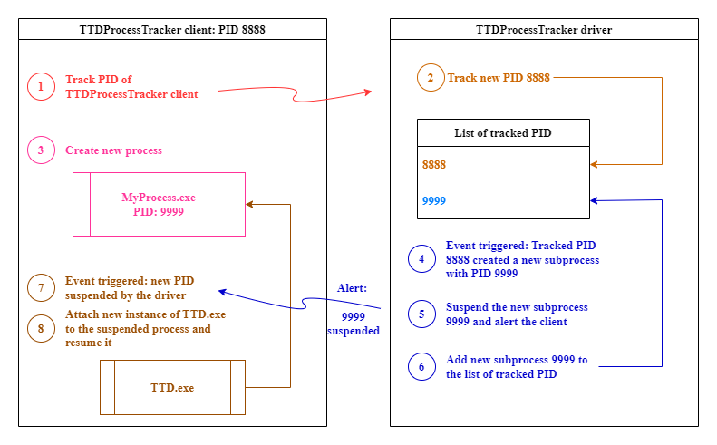

# TTDProcessTracker
#### Record child processes with Time Travel Debugging

> ⚠️ **Note:**
>
> This project was initially started when the "follow child process" option wasn't availble with TTD.
> Now, thanks to official TTD.exe CLI, you can just use `-children` to follow child processes.
> See the [Microsoft documentation](https://learn.microsoft.com/en-us/windows-hardware/drivers/debugger/time-travel-debugging-ttd-exe-command-line-util#additional-command-line-options)


## How it works



## Installation and usage

> ⚠️ **Note:**
>
> This project relies on a Windows driver and should be used inside a Virtual Machine, otherwise you might experience some BSOD 🟦

First, build the project with visual studio compiler.
Then, use the script to start the driver.
Launch the tracker with the name of the program to track.
Finally, stop the driver.

```powershell
.\startpt.cmd
.\Tracker .\path\to\process\to\track .\path\to\out\folder
.\stoppt.cmd
```